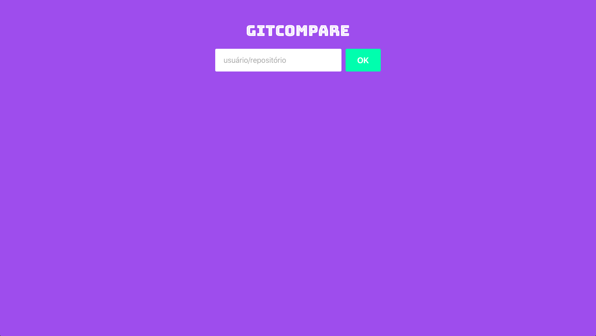
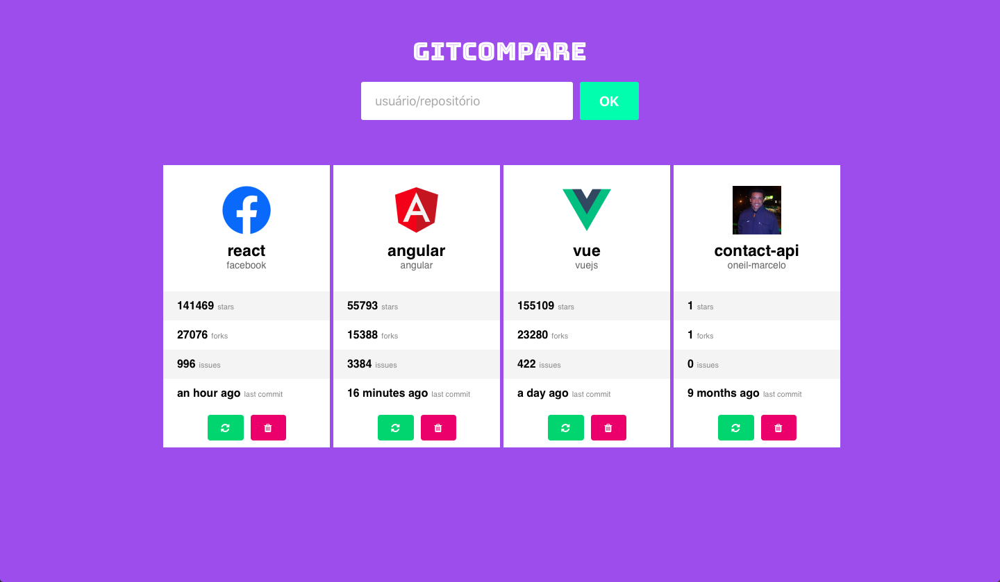

# GitCompare
O repositório é estudo da biblioteca React e ReactJS.

## Tecnologias e Conceitos
* React e ReactJS
* Componentização
* Component fullstate e stateless
* Estilização com styled-component

## Sobre Aplicação
A aplicação lista repositórios do GitHub para comparação.
Nela é possível comparar diversos repositórios de um mesmo proprietário ou diversos repositórios de diversos usuários.

[Ver GitCompare online](http://lab.yeza.com.br/gitcompare)

## Resultado

#### *Tela inicial com formulário para adicionar repositórios* ####

#### *Tela com repositórios para comparação* ####

